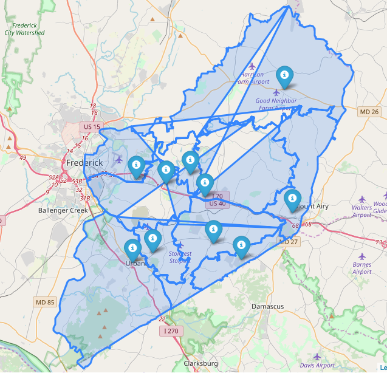

### Sentiment Analyses of Linganore-Oakdale-Urbana Area Redistricting (A two-week project)

@Meng Chen

---------------------------
### About

Southeastern communities of Frederick County has been growing steadfast due to newly approved development projects in this area. Local schools have been growing over their designed capacity for years. Particularly, in Urbana area, a huge working force will join the local community as a new biopharmaceutical manufacturing facility is being established by [Kite Pharma](https://www.kitepharma.com) and a hotel and restaurant chain will be build in next two years. There is a urgent need to redistrict local schools based on changing feeding patterns.

Based on the message of the Board of Education, Frederick County, the redistricting roots on the inequal development of the local communities ([here for detials](https://www.fcps.org/capital-program/linganore-oakdale-urbana-area-redistricting-study).) However, the redistricting study stired local communities because of concerns of the student development, property price, community integrity, and etc.

This project primarily focuses on sentiments after the second-round proposal for redistricting LOU. The analyses were based on public avaliable datasets (survey results and current districts) provided by CropperGIS Inc that is contractor carries out the LOU redistricting study and Frederick County, respectively.

---------------------------

### Data origination

The original survey data can be download as [PDF files](https://www.fcps.org/capital-program/lou-meetings).

The shapefile that can be download at Frederick County [website](https://www.frederickcountymd.gov/5969/Download-GIS-Data).

---------------------------

### redistrict Module
This module includes three newly developed classes, _SentiAnalysis()_, _shape2json()_, and _MapVisualization()_. Each class have been specifically
developed to analyze the public accessible data of LOU Redistricting.

Class  | Description
------ | -----------
SentiAnalysis() | Analyze the sentiments of the comments on school redistricting in LOU Area
shape2json() | Convert the shapefile to geojson for visualization (internally convert ESPG 2236 to ESPG 4483)
MapVisualization() | Visualize the results on a interactive map.

---------------------------

### _SentiAnalysis()_
The class can take either a string or a text file as input to calculate sentiment scores. It cleans the text before the analyses. The SentiWordNet 3.0 has been used to score the sentiments of the words. Three different weighting schemes have been used. In addition, the proportion of positive, negative, and neutural feedbacks are generated as well raw scores of individual word in the data.

**Input**:
```python
'SentAnalysis().scoreText('Welcome to our new house.')'
```
**Output**:                                                                 
Mean Score (Arithmetic | Geometric | Harmonic) | Percentage (Positive | Negative | Neutral) | Raw Scores


---------------------------

### _shape2json()_
The class converts shapefile downloaded from Frederick County Governemnt website to geojson. Some of record names in the shapefile are not consistent, which needs to customerize before the conversion.
The ESPG of the shapefiles created by ArcGIS is 2248. Internal function _coordinateConvert()_ were created to convert the coordinates to ESPG 4326 for map plots.
The outputs are json files for each elementary, middle, and high school district.
In addition, the class provides coordinates for each school based on their address.

**Unfortunately, this two-week time window has hinder my effort to clean up the shapefiles. The polygon plots in the interactive maps are not ideal. I will come back to work on this around October.**

---------------------------

### _MapVisualization()_
This class visualize the results in a interactive map. Mulitple arguments have been listed, including coordiantes, score(mean score, percentage, or raw), option (A, B, AB) and etc.
**Input**:
```python
'MapVisualization(coordinates, score, 'A', 'Frederick, MD', 'ES.json').foliumVisual('blue')'
```
**Output**                                              
**(Please forgive me for not having time to further clean the shapefile)**


If you have any questions, please contact me at meng.chen03@gmail.com.
