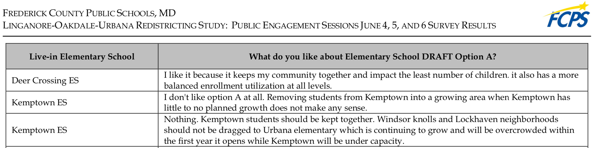
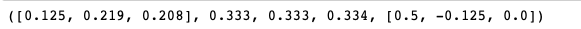
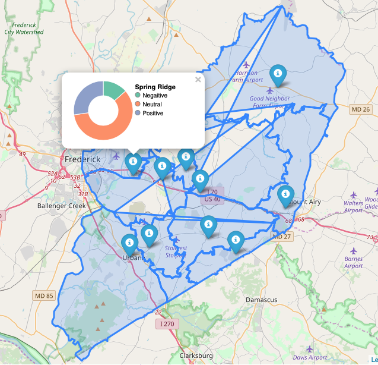

### Sentiment Analyses of Linganore-Oakdale-Urbana Area Redistricting

Author @Meng Chen

---------------------------
### 1. Introduction

Linganore-Oakdale-Urbana (LOU) Area is located in the southeastern area of the Frederick County of Maryland. During last ten years, the local communities have been transformed into well-maintained suburban residency for people who work in the Washington-Maryland area. Many professionals, such as administrative government employees or military personals chose to live in these neighborhoods, despite the distant transportation between their working place and home. Even some government facilities has located in this area. For an example, the Social Security Data Center is located next to the Park and Ride of the Exit 26 of Interstate-270 in the Urbana area. Recently, [Kite Pharma](https://www.kitepharma.com) is starting to build a pharmaceutical manufacturing facility here, and along its side, there will be a hotel and restaurant chain established in two years. Urbana area becomes the prime area for both business and residents.

These ongoing developments bring prosperity to the local communities. So does anxiety. For an example, the workforce brought by Kite Pharma has been estimated about 200-300 employees initially to 700-900 by its capacity. Such huge workforce will need hundreds of houses and/or apartments to acommendate their housing needs. Thus, the estate projects have been steadfastly developed in this area. More and more houses starts to show themselves off the landscape. However, only two new elementary schools have been added to the area, which cannot alleviate overcrowd situations in schools. It becomes clear that, without any additional government funding, the Board of Education of Frederick County has an urgent need to conduct school redistricting based on changing feeding patterns.

Starting in January, 2019, Frederick County has contracted with Cropper GIS Consulting to conduct the redistricting study, which is expected to completed by the end of the 2019. This study primarily focuses on attendance boundary and feeder patterns for two new schools that supposedly address the enrollment growth in this area and provides projections of the school enrollments in next 5-8 years. Based on the message of the Board of Education, the redistricting roots in their core belief that all students are entitled equally to respect, opportunity, and excellence ([here for details](https://www.fcps.org/capital-program/linganore-oakdale-urbana-area-redistricting-study).) However, after the Public Engagement Session in March, 2019, the proposed attendance boundary stirred the outrage from local communities based on analyses of the parents' feedbacks provided by the study. Such outrage seems to be alleviated by the new proposed attendance boundary at the Public Engagement Session of June, 2019 based on an initial assessment. Unfortunately, the quantitative assessment of parents' preferences were not provided to the public prior to the superintendent's recommendation that was presented on September 11, 2019.

This project primarily focuses on the sentiment and preferences of parents for new proposed options after Public Engagement Session in June, 2019. The parents' preferable options will be compared with the plan of the superintendent's recommendation to investigate whether Board of Education's choices are aligned with  parents' preferences and why. These will help board members understand the if parents support or oppose which option and parents recognize the education needs of the majority of the each community.

---------------------------

### 2. Materials and Methods

---------------------------

#### 2.1 Materials

---------------------------

The survey results after Public Engagement Session in June, 2019 for LOU Redistricting Study can be found in Frederick County Public Schools [website](https://www.fcps.org/capital-program/lou-meetings). The feedbacks are compiled in a PDF file, and represented as multiple tables in 209 pages. Prior to analyze the comments, the PDF file were converted to an excel file with three columns (school name, comments, and options). Additional cleaning proceedures will be detailed in the Methods.


The shapefiles of Frederick County School District have been downloaded at Frederick County [website](https://www.frederickcountymd.gov/5969/Download-GIS-Data). The shapefile contains the polygon data that splits the all Frederick County Public schools into different school district and were used to visualize the results. The shapefile was generated by ArcGIS under EPSG 2248. The EPSG was short for European Petroleum Survey Group but now known as the Geomatics Committee of the International Association of Oil and Gas Producers(OGP). 2248 is the EPSG spatial reference ID for Maryland. To project the Maryland to the world map, the coordinates in shapefile of Maryland were converted under the spatial reference ID EPSG 4326. See Methods for details.

---------------------------

#### 2.2 Methods
___________________________

I used Python to create three classes to analyze the data and visualize the results. Each of class has specific methods to analyze data and output the results. I assemble them all together as a module named 'redistrict'. See below for details of functionality of each class as well as methods inside.

#### 2.2.1 redistrict Module
This module includes three newly developed classes, ___SentimentAnalysis()__, ___Shape2Json()___, and ___MapVisualization()___. Each class have been developed to address certain questions during the analyses.

Class  | Description
------ | -----------
SentimentAnalysis | Build a word score dictionary based on SentiWordNet 3.0; calculate the score of the sentiment of parents' feedbacks
Shape2Json| Convert the ESRI shapefile to geojson file; convert coordinates from the Maryland geospatial reference to the world one
MapVisualization | Visualize the sentiment score of different school districts on a interactive map

---------------------------

#### 2.2.1.1 The class of the sentiment analysis
```Python
class SentimentAnalysis():

    def __init__(self, base='SentiWordNet.txt'):
      self.base = base
      self.swn_all_words = {}
      self.build_swn(base)
```
In general, the class calculates the scores of the sentiments of text, and the input can be either string or text file. The results will include mean score, percentage, and row scors of all words.

```Python
def weighting(self, method, score_list):
```
It uses different weighting methods to calculate the mean of the sentiment score.

Parameter | Description
----|----
`method` | arithmetic, geometric, and harmonic
`score_list` |a list of the row sentiment scores of the words

```Python
def build_swn(self, base):
```
This function build a dictionary of the sentiment score of each word in the SentiWordNet 3.0. The original SentiWordNet file has been modified to remove unnecessary heading and descriptive details about the SentiWordNet project prior to input for building the dictionary.

Parameter | Description
----|----
`base` | the sentiment score data of the SentiWordNet project, version 3.0

```Python
def clean_text(self, filename):
```
It changes the upper case to lower case as well removes non-word characters in a sentence or a paragraph and compile them together for scoring the sentiment.

Parameter | Description
----|----
`filename` | an input of either a string or a txt file

```Python
def score_text(self, text):
```
This score the sentiment of words in the sentence or paragraphs, and calculate the mean score (arithmetic, geometric, and harmonic) of the sentiments embeded in the words. In addition, it will calculate the percentage of positive, negative, and neural sentiment for understanding the preferences of the parents. Raw score for each word are also be recorded.
Parameter | Description
----|----
`text` | the text file after cleaning

#### An Example:

**Input**:
```python
SentimentAnalysis().score_text('Welcome to our new house.')
```
**Output**:                                                                 
Mean Score (Arithmetic | Geometric | Harmonic) | Percentage (Positive | Negative | Neutral) | Raw Scores


---------------------------

#### 2.2.1.2 The class for converting shapefile to geojson
```Python
class Shape2Json:

    def __init__(self, fname, output1, output2, school_param, school_list,
                 addresses=None, coordinates=None):
        self.fname = fname
        self.output1 = output1
        self.output2 = output2
        self.school_param = school_param
        self.school_list = school_names
        self.addresses = addresses
        self.coordinates = coordinates
```
The class converts an ESRI shapefile into a geojson file and get the coordinates of each school. Unfortunately, during the generation of the shapefiles, both 'SCHOOL' and 'SCHOOL_1' has been used for a field attribute. the The conversion of the shapefile are two-step process using two methods, convert_json and convert_epsg.

Parameter | Description
----|----
`fname` | an input of the shapefile's name
`output1` | json output after converting the shapefile
`output2` | json output after converting output1 from the spatial reference of Maryland to the spatial reference of world
`school_param` | 'SCHOOL' used in one of field attributes for elementary and high schools; 'SCHOO_1' used for middle schools
`school_list` | school names by grouping elementary, middle, and high schools separately
`addresses` | the school addresses
`coordinates` | the gps cooridinates of the schools

```Python
def convert_json(self):
```
It converts shapefile into geojson file. All files have been output as `output1`.

```Python
def convert_epsg(self):
```
The function converts json file of output1 that was generated under spatial reference EPSG 2248 to the spatial reference of world EPSG 4326. The files contains not only 'Polygon' but also 'MultiPolygon' which requires additional step for conversion.
In addition, this function attain the school address from the output1.

```Python
def get_coordinates(self):
```
The functionality is to acquire the GPS coordinates of every school in the project.

---------------------------

#### 2.2.1.3 The class visualizing the results
```Python
class MapVisualization():

    def __init__(self, coordinates, score, option, location, polygon):
      self.coordinates = coordinates
      self.score = precentage
      self.option = option
      self.location = location
      self.polygon = polygon
```
Parameter | Description
----|----
`coordinates` | the GPS coordinates of the schools
`score` | the sentiment score that can be represented as  percentage of the positive, negative, and neural feedbacks from parents for visualizing the pie chart
`option` | proposed option A and option B
`location` | centeral location of the map
`polygon` | the coordiantes of school districts by elementary, middle, and high

This class uses folium madule to plot results in an interactive maps. Each school is represented by popup icon with a pie chart indicating percentage of sentiments of parents' feedback.

```Python
def get_json(self, data, school_name):

```
Parameter | Description
----|----
`data`| sentiment score data
`school_name`| the name of each school

It uses `vincint` module to acquire json data of the pie chart of the results.

```Python
def folium_visual(self, col):
```
Parameter | Description
----|----
`col`| the color of your choice for popup icon


### 3. Results
The final results vary by different neighborhoods. For an example, parents in Urbana area provide great positive feedbacks for the new proposals of middle and high schools, while they provided more neural feedbacks for elementary school district. Such a results indicate a great improvement of the new proposal, as parents were furious about the previous proposal, suggesting that the board of the education has listened to the residents of the Urbana area to improve their redistricting effort on middle and high school redistricting. However, it remains unclear if parents found the common ground of the elementary school redistricting. Together, this will help board of the education make decision on which option would they choose for the superintendent recommendation.

#### An Example:

**Input**:
```python
MapVisualization(coordinates, score, 'A', 'Frederick, MD', 'ES.json').foliumVisual('blue')
```
**Output**                                              
**(Please forgive me for not having time to further clean the shapefile)**



If you have any questions, please contact me at meng.chen03(at)gmail.com.
