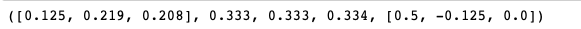

## Sentiment Analyses of Linganore-Oakdale-Urbana Area Redistricting

Author @Meng Chen

---
## 1. Introduction

Linganore-Oakdale-Urbana (LOU) Area is located in the southeastern area of the Frederick County of Maryland. During last ten years, the local communities have been transformed into well-maintained suburban residency for people who work in the Washington-Maryland area. Many professionals, such as administrative government employees or military personals chose to live in these neighborhoods, despite the distant transportation between their working places and homes. Even some government facilities have been located in this area. For an example, the Social Security Data Center is located next to the Park and Ride of the Exit 26 of Interstate-270 in the Urbana area. Recently, [Kite Pharma](https://www.kitepharma.com) is starting to build a pharmaceutical manufacturing facility here, and along its side, there will be a hotel and restaurant chain established in two years. Urbana area has become the prime area for both business and residents.

These ongoing developments bring prosperity to the local communities. So does anxiety. For an example, the workforce brought by Kite Pharma has been estimated about 200-300 employees initially to 700-900 by its capacity. Such huge workforce will need hundreds of homes to accommodate their housing needs. Thus, the estate projects have been steadfastly developed in this area. More and more houses starts to show themselves off the landscape. However, only two new elementary schools have been added to the area, which obviously could not alleviate overcrowd situations in local schools. It becomes clear that, without any additional government funding, the Board of Education of Frederick County has an urgent need to conduct school redistricting at the basis of changing feeder patterns.

Starting in January, 2019, Frederick County has contracted with Cropper GIS Consulting to conduct the redistricting study, which is expected to completed by the end of the 2019. This study primarily focuses on attendance boundary and feeder patterns for two new schools that supposedly address the enrollment growth in LOU area and provides projections of the school enrollments in next five-eight years. Based on the message of the Board of Education, the redistricting roots in their core belief that all students are entitled equally to respect, opportunity, and excellence ([here for details](https://www.fcps.org/capital-program/linganore-oakdale-urbana-area-redistricting-study)). However, after the Public Engagement Session in March, 2019, the proposed attendance boundary stirred the outrage from local communities based on analyses of the parents' feedbacks provided by the study. Most of parents show extremely frustrated by new attendance boundaries. Some parents in Urbana area for example organized a local hearing to express their frustration to a member of the Board of Education. With entirely two new options proposed in the Public Engagement Session in June, 2019, such outrage seems to be alleviated based on an initial assessment. Unfortunately, the quantitative assessment of parents' preferences were not available to the public prior to the superintendent's recommendation that was presented on September 11, 2019.

This project primarily focuses on the sentiment and preferences of parents for new proposed options after the Public Engagement Session in June, 2019. The parents' preferable options will be compared with the plan of the superintendent's recommendation to investigate whether Board of Education's choices are aligned with parents' preferences and seek potential explanation. These will help board members understand the if parents support or oppose which option in a quantitative way and identify which communities have been mostly affected after June's proposal on the basis of the parenets' feedbacks. In addition, the results will help parents recognize the educational needs of the majority of the their local communities.

---
## 2. Materials and Methods

### 2.1 Materials
### 2.1.1 Survey dataset
The survey results after Public Engagement Session in June, 2019 for LOU Redistricting Study can be found in Frederick County Public Schools [website](https://www.fcps.org/capital-program/lou-meetings). The feedbacks are compiled and represented in numerous tables spreading among 209 pages of single PDF file. Prior to the analysis, the PDF file were converted to an excel file containing school name, comments, and options. See Methods for additional cleaning procedures.

##### **Original Survey Comments**


##### **Converted Survey Comments**


### 2.1.2 Shapefile
The shapefiles of Frederick County School District have been downloaded at Frederick County [website](https://www.frederickcountymd.gov/5969/Download-GIS-Data). The shapefile contains the basic information of school districts, including school names, school address, the types of schools, and the polygon data that separates school districts. The shapefile was created by ESRI ArcGIS under EPSG 2248. The EPSG was short for European Petroleum Survey Group but now known as the Geomatics Committee of the International Association of Oil and Gas Producers (OGP). 2248 is the EPSG spatial reference ID for Maryland. To project the Maryland to the world map, the original coordinates of Maryland were converted under the spatial reference ID EPSG 4326 of world map. See Methods for details.

---

### 2.2 Methods
I used Python programming language to develop three classes to quantify the parents' comments as sentiment score and to visualize the sentiments in interactive maps. Each of class has specific methods for analyzing data, saving outputs, and/or visualizing the results. Three classes are compiled together as a module named 'redistrict'. See below for details of the functionality of each class as well as methods within it.

### 2.2.1 redistrict Module
This module includes three newly developed classes, `SentimentAnalysis`, `Shape2Json`, and `MapVisualization`. Below is brief description of each class.

Class  | Description
------ | -----------
`SentimentAnalysis` | Build a sentiment score dictionary of words based on SentiWordNet 3.0; calculate the score of the sentiment of parents' feedbacks
`Shape2Json`| Convert the ESRI shapefile to geojson file; convert coordinates from the Maryland geospatial reference to the world spatial reference
`MapVisualization` | Visualize the sentiment score of different school districts on a interactive map

### 2.2.1.1 The class for the sentiment analysis
```Python
class SentimentAnalysis:

    def __init__(self, base='SentiWordNet.txt'):
        self.base = base
        self.swn_all_words = {}
        self.build_swn(base)
```
In general, this class calculates the scores of the sentiments of words of a string or a text file. The results will include mean score, percentage, and raw scores of all scored words. The SentiWordNet 3.0 can be download at [here](https://github.com/aesuli/SentiWordNet).

```Python
    def weighting(self, method, score_list):
```
It uses different weighting methods to calculate the mean of the sentiment score.

Parameter | Description
----|----
`method` | arithmetic, geometric, or harmonic method
`score_list` | a list of the raw sentiment scores of the words

```Python
    def build_swn(self, base):
```
This function builds a dictionary of the sentiment scores of words based on SentiWordNet 3.0. The heading and descriptive details of SentiWordNet project has been removed prior to the input for building the dictionary.

Parameter | Description
----|----
`base` | the sentiment score data of the SentiWordNet project, version 3.0

```Python
    def clean_text(self, filename):
```
It changes the upper case to lower case as well as removes non-word characters in a sentence or a paragraph before compiling them together for scoring the sentiment.

Parameter | Description
----|----
`filename` | an input of either a string or a txt file

```Python
    def score_text(self, text):
```
This scores the sentiment of each word in the sentence or paragraphs, and calculate the mean score (arithmetic, geometric, and harmonic) of the sentiments. In addition, it quantify the percentage of positive, negative, and neural sentiment for understanding the preferences of the parents. Raw score for each word are also be recorded.

Parameter | Description
----|----
`text` | a text or a file name

#### An Example:

**Input**:
```python
SentimentAnalysis().score_text('Welcome to our new house.')
```
**Output**:                                                                 
Mean Score (Arithmetic | Geometric | Harmonic) | Percentage (Positive | Negative | Neutral) | Raw Scores


### 2.2.1.2 The class for converting shapefile to geojson
```Python
class Shape2Json:

    def __init__(self, fname, output1, output2, school_param, school_list,
                 addresses=None, coordinates=None):
        self.fname = fname
        self.output1 = output1
        self.output2 = output2
        self.school_param = school_param
        self.school_list = school_names
        self.addresses = addresses
        self.coordinates = coordinates
```
The class converts an ESRI shapefile into a geojson file and get the coordinates of each school. It is noted that, during the generation of the shapefiles, both 'SCHOOL' and 'SCHOOL_1' has been used for a field attribute. In general, the conversion of the shapefile are two-step process using two methods, convert_json and convert_epsg.

Parameter | Description
----|----
`fname` | an input of the shapefile's name
`output1` | json output after converting the shapefile
`output2` | json output after converting output1 from the spatial reference of Maryland to the spatial reference of world
`school_param` | 'SCHOOL' used in one of field attributes for elementary and high schools; 'SCHOO_1' used for middle schools
`school_list` | a list of elementary schools, middle schools, or high schools
`addresses` | a list of school addresses
`coordinates` | a list of the cooridinates of the schools

```Python
    def convert_json(self):
```
It converts shapefile into geojson file. All files have been output as `output1`.

```Python
    def convert_epsg(self):
```
The function converts json file of output1 that was generated under spatial reference EPSG 2248 to the spatial reference of world EPSG 4326. The files contains not only 'Polygon' but also 'MultiPolygon' which requires additional step for conversion. In addition, this function attains the address of each school.

```Python
    def get_coordinates(self):
```
Its functionality is to acquire the GPS coordinates of every school in the study for visualization.

### 2.2.1.3 The class visualizing the results
```Python
class MapVisualization:

    def __init__(self, coordinates, score, option, location, polygon):
        self.coordinates = coordinates
        self.score = precentage
        self.option = option
        self.location = location
        self.polygon = polygon
```
Parameter | Description
----|----
`coordinates` | the GPS coordinates of the schools
`score` | the sentiment score that can be represented as  percentage of the positive, negative, and neural feedbacks from parents
`option` | proposed option A and option B for school redistricting
`location` | central location of the map
`polygon` | the coordinates of school districts by elementary, middle, and high

This class uses folium module to plot results in interactive maps. Each school is represented by popup icon with a pie chart indicating percentage of sentiments of parents' feedback.

```Python
    def get_json(self, data, school_name):
```
Parameter | Description
----|----
`data`| sentiment score data
`school_name`| the name of the school

It uses `vincint` module to acquire json data of the pie chart of the results for visualization.

```Python
    def folium_visual(self, col, file_name):
```
Parameter | Description
----|----
`col`| the color of your choice for popup icon
`file_name`| save the interactive map to a file in the results folder

---
## 3. Results and Conclusion
In general, six interactive maps have been produced based on three school categories and two options. The sentiments vary by different neighborhoods. For an example, parents in Urbana area provide great positive feedbacks for the new proposals of middle and high school redistricting, while they provided more neural feedbacks for elementary school district. Such results indicate a great improvement of the new proposal considering the feedbacks from Engagement Session on March, 2019, suggesting that the board of the education has listened to the residents of the Urbana area to improve their redistricting proposal on middle and high school districts. However, it remains unclear if parents found the common ground of the elementary school redistricting. Similar other neighborhoods show either support or oppose to the new proposal.
By identifying the sentiment and preference of the parents in different neighborhoods, this project helps the members of the Board of Education understand the impact of redistricting on LOU area and provides references to board members for making final decision on which option would they choose for the superintendent recommendation. In addition, the parents in local communities can easily assess the emotions among their neighbors via visualized results and recognize if their educational needs are align with the majority of their neighborhoods.

It should be noted that the algorithm of the sentiment analysis is not perfectly optimized and needs to incorporate with Natural Language Toolkit (`nltk`). Additionally, the json files for visualization should be further cleaned in order to form a complete polygon for each school district. However, because of the limited schedule, the project current can still be used as initial assessments for understanding the needs of parents after the Engagement Session on June, 2019. Future revision of the project will be carried out in order to address those issues.

#### An Example:

**Input**:
```python
MapVisualization(coordinates,
                 score,
                 'A',
                 'Frederick, MD',
                 'ES.json').foliumVisual('blue', 'results/es_A.html')
```
**Output**                                              
**(Please forgive me for not having time to further clean the shapefile)**


---
If you have any questions, please contact me at meng.chen03(at)gmail.com.
