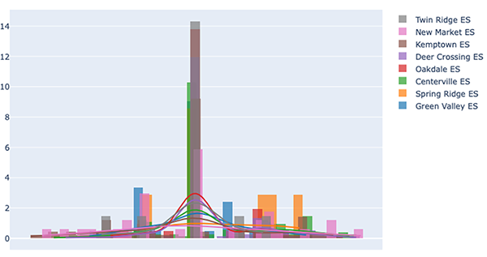

#### About

# **Better or Worse?**
## **Problem**
School redistricting in Linganore-Oakdale-Urbana (LOU) area has stirred outcry from the local communities in the social media. In order to understand the concerns about local communities, Frederick County Board of Education provided an online platform for community members to express their opinions and conducted a basic statistics of local community concerns. However, their analyses lack of details about what sentiment of the local communities were and why the communities show favor/disfavor to the school redistricting plans.

## **Insights**
* The positive feedbacks of LOU commmunities towards the second-round-proposed school redistricting plans indicate that the latest plans present merits that statisfy local communities.
* Using interactive analyses on the sentiment, local education adminstration could effectively identify where needs are and tailor its resources to address those local community needs, which would save time and money.
* My [web app](https://bit.ly/BetterOrWorseDemo) could serve as a platform for general public to understand their neighbours' feelings of the school redistricting studies. For more details, please click here.

## **Data**
The community feedbacks for the second-round proposals of new school districts were assembled in single pdf file that contains numerous tables stratching over 200-page long. The tables store feedbacks for elementary, middle, and high school districts of LOU area in Frederick County, MD. Each school district have tables for options A and B as well as some comments related but not specific to any option. I desginated those unspecific comments to option AB.

## **Approach**
In order scrape the data from the pdf file, I extract the comments and parse them into dataframe and stored them in a SQL database. To improve the efficiency of analyzing the data, I created `redistrict` module to scrape data, to perform exploratory data analyses and sentiment analyses, and to finally visualize the insights.

#### **Python Module** `redistrict`
In the module, I developed three classes `PdfTable`, `CommentSentiments`, and `VisualizeResults` to perform the majority of the required functionality.

* `PdfTable`: extracting the data from a pdf file and to parse information to store it into a SQL database;
* `CommentSentiments`: visualizing the Word Clouds of community feedbacks, calculating sentiment scores, performing exploratory analyses, and visualizing the results;
* `VisualizeResults`: parsing the results by different school districts and visualizing the results in a interactive map.

## **Tools and Techs**
* Python
    * Camelot
    * Worldcloud
    * Streamlit
    * Folium
    * GeoPandas
    * NLTK
    * Plotly
    * Vincent
    * Geopy
* OpenStreetMap(OSM)
* NLP
* Feature Engineering
* SQL
* AWS EC2, S3
